<!-- YoRHa personnel record -->

  

  

  
  

  

  

  <a href="https://github.com/alde-oli/ft_place_bot"></a>
  <a href="https://github.com/alde-oli/webserv"></a>
  <a href="https://github.com/alde-oli/ft_transcendance"></a>
  <a href="https://github.com/alde-oli/SuperMiniRT"></a>
  <a href="https://github.com/alde-oli/minishell"></a>
  <a href="https://github.com/alde-oli/Inception"></a>
  <a href="https://github.com/alde-oli/upsi-jam-5"></a>
  <a href="https://github.com/alde-oli/dslr"></a>

▸ Further records

| Record | Summary |
|---|---|
| [TLAPlus](https://github.com/alde-oli/TLAPlus) | Header-only C++ math library from scratch, with a SIMD `Vector` draft. |
| [ft_linear_regression](https://github.com/alde-oli/ft_linear_regression) | Linear regression with gradient descent, from scratch in Python. |
| [ComputorV1](https://github.com/alde-oli/ComputorV1) | Polynomial equation parser and solver in C++, with complex roots. |
| [swifty_companion](https://github.com/alde-oli/swifty_companion) | Flutter app showing a 42 student's level, skills and projects from the 42 API. |
| [philosophers](https://github.com/alde-oli/philosophers) | Dining philosophers with threads and mutexes, processes and semaphores as a bonus. |
| [pipex](https://github.com/alde-oli/pipex) | Shell pipeline clone: fork, pipe, dup2, execve, multi-pipe and here_doc. |
| [push_swap](https://github.com/alde-oli/push_swap) | Sorting with two stacks and a minimal set of operations, plus a checker. |
| [fdf](https://github.com/alde-oli/fdf) | 3D wireframe map renderer with MiniLibX. |
| [cpp_piscine_p1](https://github.com/alde-oli/cpp_piscine_p1) · [p2](https://github.com/alde-oli/cpp_piscine_p2) | 42 C++ modules 00–09. |
| [libft](https://github.com/alde-oli/libft) · [ft_printf](https://github.com/alde-oli/ft_printf) · [get_next_line](https://github.com/alde-oli/get_next_line) | First 42 C projects. |

  <a href="https://www.linkedin.com/in/alexandre-deoliveiramaia"></a>

Visual style is a fan homage to the menus of <i>NieR:Automata</i> (© Square Enix / PlatinumGames); no game assets are used and this profile is not affiliated with them. Palette based on <a href="https://github.com/metakirby5/yorha">metakirby5/yorha</a> (MIT). UI principles from the <a href="https://www.platinumgames.com/official-blog/article/9624">PlatinumGames blog</a>. Font: <a href="https://fonts.google.com/noto/specimen/Noto+Sans">Noto Sans</a> (SIL OFL 1.1), embedded. Sperm-whale emblem drawn by hand in SVG (<code>emblems.py</code>) after NOAA reference photos (public domain), in the style of the game's weapon illustrations. SVGs generated by <code>build.py</code>.
