<!-- YoRHa personnel record -->
<p align="center">
  
</p>

```
▸ YoRHa // UNIT ALDE-OLI
```

| UNIT DATA | |
|---|---|
| Name | Alexandre De Oliveira Maia |
| Role | Backend & Platform developer @ [SyncAI](https://syncai.ch) |
| Location | Lausanne, Switzerland |
| Training | 42 Lausanne (alumni) · 42 Pro Training Machine Learning |
| Languages | French (native) · English (fluent) |

I build Python/Django tools that automate business decisions (setting a price, proposing a supplier order, reading an order confirmation) and I take them to production reliably: deployment pipeline, monitoring, backups.
Since late 2024 I've worked at SyncAI on **Athena**, a repricing and product-integration platform for sellers on **Digitec Galaxus**. In 2026 I also took over the CI/CD, servers and alerting.
How I work: I check before I ship. Changes get tested on copies, backups get restored before a switchover, and a deployment only goes out after a health check passes.

## ▸ Stack


## ▸ Mission log

Professional work. The code is private, so there are no links here.

```
[2024 ─ now]  ATHENA · SyncAI
              Repricing & integration platform for Digitec Galaxus sellers.
              ─ Python/Django backend: catalogue sync, competitor-offer tracking,
                automatic pricing (margin, fees, VAT, shipping), publication of
                prices, stock and product data.
              ─ Designed the move from Airflow to ~10 Python microservices
                driven by PostgreSQL queues.
              ─ Migration to the marketplace's official API and feeds.
              ─ Near-real-time sales and pricing analytics module.

[2026 ─ now]  PLATFORM & RELIABILITY · SyncAI
              ─ GitLab CI/CD: automated tests, continuous deployment to staging,
                production rollout gated by a health check.
              ─ Linux staging/production servers, firewall, key rotation.
              ─ Grafana alerting as code; PostgreSQL backups restored and
                verified before switchover.
              ─ Test-suite overhaul, contribution conventions, docs, code review.

[2026 ─ now]  PROCUREMENT AUTOMATION · consulting for a Swiss technical-distribution SME
              ─ On-site audit, then improved the existing ERP's order-proposal
                engine (Access, SQL Server, VBA) without a migration.
              ─ Automatic reading of supplier confirmations (PDF, OCR, generative
                AI), matched against orders. The buyer reviews the discrepancies
                and approves them.
              ─ Both are in production.
```

## ▸ Archive

Selected public repositories.

| Record | Summary | Stack |
|---|---|---|
| [ft_place_bot](https://github.com/alde-oli/ft_place_bot) | Bot that keeps a pixel-art image intact on 42 Lausanne's FTPlace board, repainting wrong pixels by priority. | Python · Poetry · CI |
| [webserv](https://github.com/alde-oli/webserv) | HTTP/1.1 server from scratch: non-blocking `poll()` loop, virtual hosts, uploads, directory listing, CGI. | C++98 |
| [ft_transcendance](https://github.com/alde-oli/ft_transcendance) | Multiplayer Pong platform with accounts, live chat, tournaments and an AI opponent. Team of 4. | Django · Channels · PostgreSQL · Docker |
| [SuperMiniRT](https://github.com/alde-oli/SuperMiniRT) | Multithreaded CPU ray tracer with reflections, textures, bump maps and a free-flying camera. Team of 2. | C · MiniLibX · pthreads |
| [minishell](https://github.com/alde-oli/minishell) | Bash-like shell: pipes, redirections, heredocs, `&&` / `\|\|` with parentheses, wildcards. Team of 2. | C · readline |
| [Inception](https://github.com/alde-oli/Inception) | WordPress stack in Docker Compose: NGINX (TLS only), PHP-FPM and MariaDB, each built from Debian. | Docker · NGINX · MariaDB |
| [upsi-jam-5](https://github.com/alde-oli/upsi-jam-5) | Game-jam platformer: split into a chained clone to swing and climb. Web build auto-deployed to itch.io. Team of 5. | Godot 4 · GitHub Actions |

<details>
<summary>▸ Further records</summary>

| Record | Summary |
|---|---|
| [dslr](https://github.com/alde-oli/dslr) | One-vs-all logistic regression and data visualisation from scratch in Julia. |
| [TLAPlus](https://github.com/alde-oli/TLAPlus) | Header-only C++ math library from scratch, with a SIMD `Vector` draft and AVX benchmarks. |
| [ft_linear_regression](https://github.com/alde-oli/ft_linear_regression) | Linear regression with gradient descent, from scratch in Python. |
| [ComputorV1](https://github.com/alde-oli/ComputorV1) | Polynomial equation parser and solver in C++, with complex roots. |
| [swifty_companion](https://github.com/alde-oli/swifty_companion) | Flutter app showing a 42 student's level, skills and projects from the 42 API. |
| [philosophers](https://github.com/alde-oli/philosophers) | Dining philosophers with threads and mutexes, and processes and semaphores as a bonus. |
| [pipex](https://github.com/alde-oli/pipex) | Shell pipeline clone: fork, pipe, dup2, execve, multi-pipe and here_doc. |
| [push_swap](https://github.com/alde-oli/push_swap) | Sorting with two stacks and a minimal set of operations, plus a checker. |
| [fdf](https://github.com/alde-oli/fdf) | 3D wireframe map renderer with MiniLibX. |
| [cpp_piscine_p1](https://github.com/alde-oli/cpp_piscine_p1) · [p2](https://github.com/alde-oli/cpp_piscine_p2) | 42 C++ modules 00–09. |
| [libft](https://github.com/alde-oli/libft) · [ft_printf](https://github.com/alde-oli/ft_printf) · [get_next_line](https://github.com/alde-oli/get_next_line) | First 42 C projects: libc re-implementation, printf, line reader. |

</details>

## ▸ Contact

[](https://www.linkedin.com/in/alexandre-deoliveiramaia)

---
<sub>▸ FR : développeur backend & plateforme chez SyncAI à Lausanne, formé à 42 Lausanne. Contact via LinkedIn.</sub>
